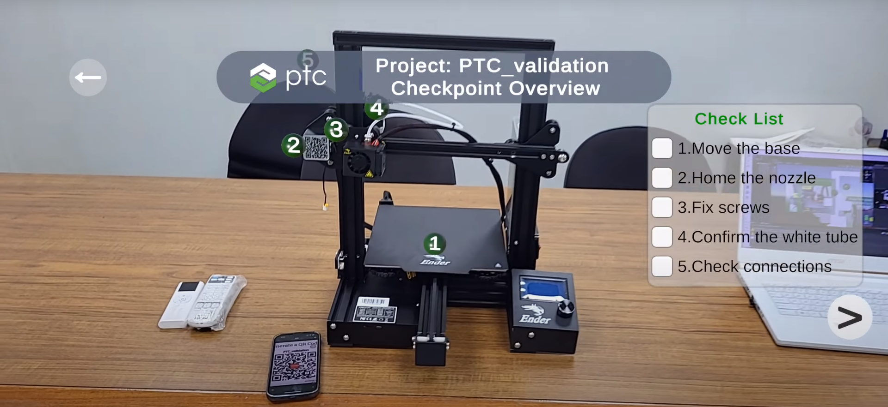

# 
3D Printer

Installation:

1. Download .tgz [file](https://cloud.solomon.com.tw/index.php/s/gzr4Rc2Z4MWW7mH) and save it in main/3D_printer/Packages/
2. Download video .mp4 [file](https://cloud.solomon.com.tw/index.php/s/9RcD2kRQsLDEWiw) for testing and save it in main/3D_printer/
3. Open unity project in 3D_printer directory.

You can get the whole project including the 3D models from [here](https://cloud.solomon.com.tw/index.php/s/NM4kjAfpXAyTCYF).

## 
Contact

For demo and free trial requests, please contact us [here](https://www.solomon.com.tw/en/home/). 
