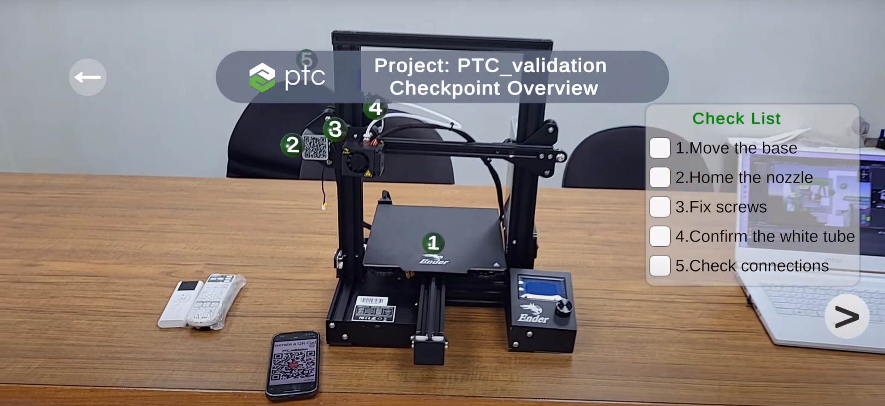

# 
Unity: Vuforia Engine with META-aivi

This is a sophisticated app crafted with Unity, leveraging the power of the Vuforia Engine for seamless AR integration, while harnessing the advanced AI capabilities of SOLOMON META-aivi for robust verification.

## 
Workflow

## 
Demo video

### 
Machine

- Source code: [here](./Machine)

### 
3D Printer

- Source code: [here](./3D_printer)

## 
License

"Unity: Vuforia Engine with META-aivi" is released under the [AGPL-3.0 License](./License).

## 
Support

If you encounter any problems, open an issue in the [Issues section](https://github.com/SOLOMON-Corporation/Unity-Vuforia-META-aivi/issues).

For general questions or support, you can also contact us at <sol.meta.aivi@gmail.com>.

## 
Contact

For demo and free trial requests, please contact us [here](https://www.solomon.com.tw/en/home/).

---
Copyright (c) SOLOMON TECHNOLOGY CORPORATION. All rights reserved.
